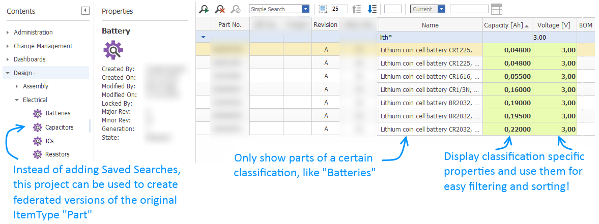

# custom-itemtype-view

This project is the preliminary result of this discussion in the Aras Forum:
http://community.aras.com/en/forums/topic/how-to-create-a-new-part-toc-menu-item-that-does-a-custom-search/

It demonstrates an alternative way to display and use Parts that share a common classification.  
The sample package will add an additional ItemType "Fake Part" to your TOC.

Benefits:
1. Control the displayed properties
2. More easy to use filter 
3. Choose the TOC position yourself.

## Project Details

#### Built Using:
Aras 11.0 SP11

#### Versions Tested:
Aras 11.0 SP15
Aras 11.0 SP11
Aras 11.0 SP9

#### Browsers Tested:
Internet Explorer 11, Chrome 66.0, Firefox ESR 52.7.4

## Installation

#### Important!
**Always back up your code tree and database before applying an import package or code tree patch!**

### Prerequisites

1. Aras Innovator installed (version 11.0 SPx preferred)
2. Aras Package Import tool
3. Import package of this project

### Install Steps

#### Database Installation
1. Backup your database and store the BAK file in a safe place.
2. Open up the Aras Package Import tool.
3. Enter your login credentials and click **Login**
    * _Note: You must login as root for the package import to succeed!_
4. Enter the package name in the TargetRelease field.
    * Optional: Enter a description in the Description field.
5. Enter the path to your local `..\custom-itemtype-view\Import\imports.mf` file in the Manifest File field.
6. Select **bpl.app.SelectStartingPage** in the Available for Import field.
7. Select Type = **Merge** and Mode = **Thorough Mode**.
8. Click **Import** in the top left corner.
9. Close the Aras Package Import tool.

##  Sample usecase

## Contributing

1. Fork it!
2. Create your feature branch: `git checkout -b my-new-feature`
3. Commit your changes: `git commit -am 'Add some feature'`
4. Push to the branch: `git push origin my-new-feature`
5. Submit a pull request

## Credits

Created by @AngelaIp
Big thanks to KalleAnka for the original idea and input!

## License

This project is published to Github under the Microsoft Public License (MS-PL). See the [LICENSE file](./LICENSE.md) for license rights and limitations.
